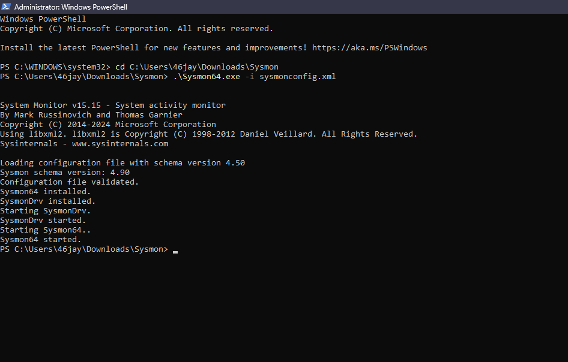
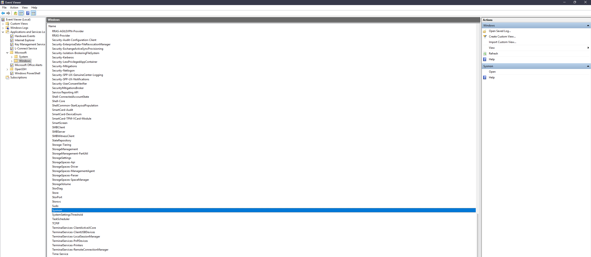
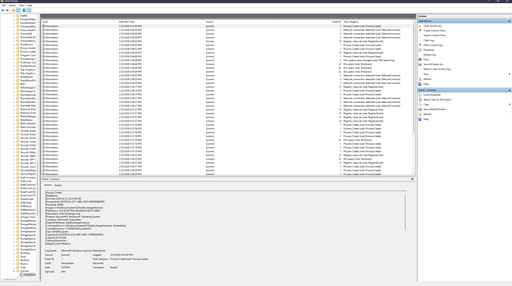
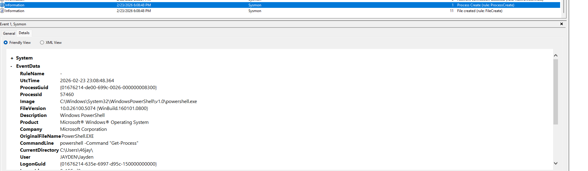
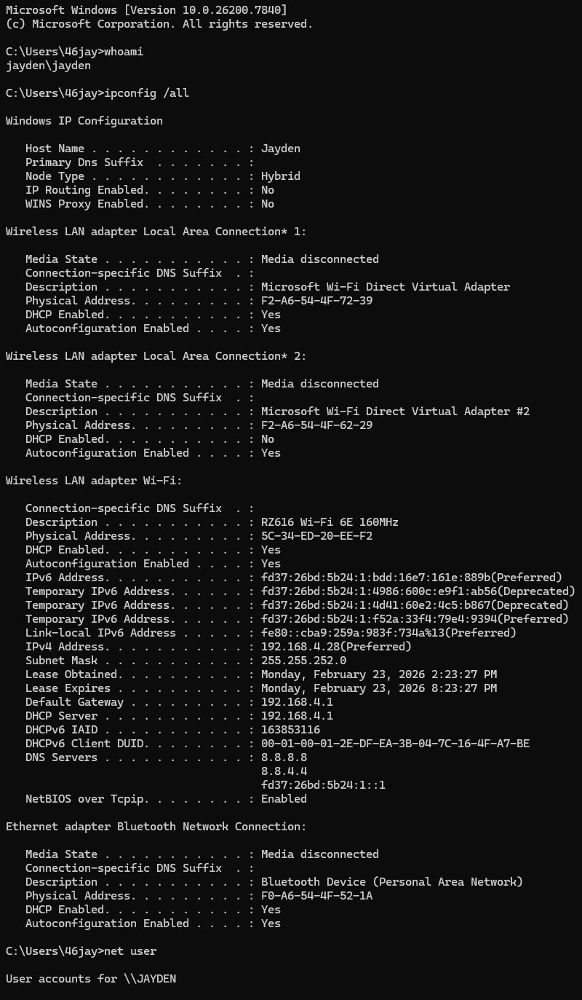
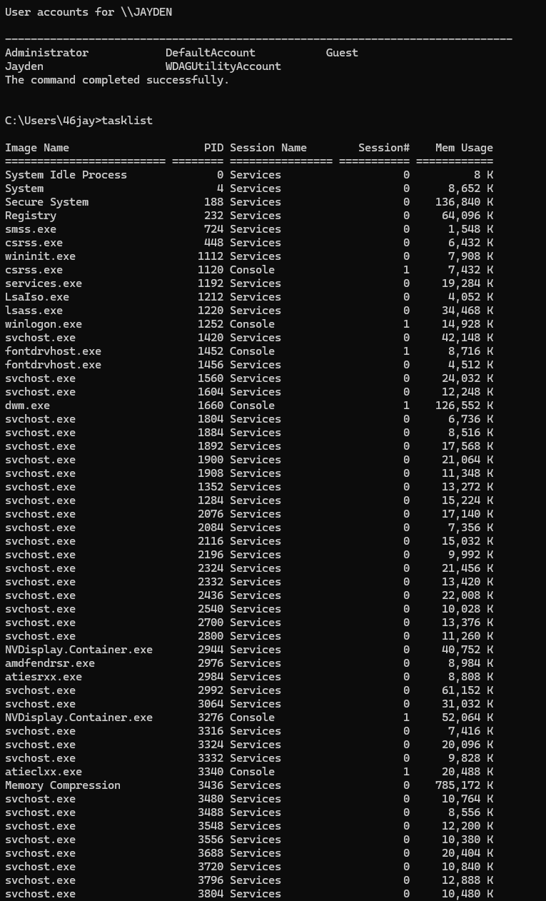

# Sysmon Detection Lab

##Lab Summary

In this lab, I installed Sysmon and configured it to log detailed process creation events. I validated logging by executing multiple commands and reviewing Event ID 1 entries in the Sysmon Operational log. This demonstrates hands on experience with Windows logging, process monitoring, and endpoint visibilit

## Objective
Install Sysmon and verify that it logs process activity into Windows Event Viewer.

## Tools Used
- Windows 10
- Sysinternals Sysmon
- PowerShell
- Event Viewer

## Steps Performed

1. Downloaded Sysmon from Microsoft Sysinternals.
2. Installed Sysmon using:
   .\Sysmon64.exe -i sysmonconfig.xml
3. Verified Sysmon service and driver started successfully.
4. Opened Event Viewer and navigated to:
   Applications and Services Logs → Microsoft → Windows → Sysmon → Operational
5. Executed PowerShell command:
   powershell -Command "Get-Process"
6. Confirmed Event ID 1 (Process Create) captured the PowerShell execution.

## Proof of Logging

Event ID 1 recorded:
- Image: powershell.exe
- CommandLine: powershell -Command "Get-Process"
- Log Name: Microsoft-Windows-Sysmon/Operational

This confirms Sysmon successfully logged process creation activity.

## Key Findings

- Sysmon provides detailed process visibility.
- Command line arguments are captured.
- Logs are stored in a dedicated Operational log.
- This data is useful for security monitoring and threat detection.

## What I Learned

This lab showed how Sysmon enhances Windows logging by capturing detailed process creation data. Seeing the command line arguments inside Event Viewer demonstrates how security teams can track user activity and detect suspicious behavior. Sysmon is valuable for SOC analysts because it provides deeper visibility than default Windows logs.

## Screenshots

### Sysmon Installation

### Sysmon Log Location

### Sysmon Operational Log

### PowerShell Process Logging

### Additional Command Activity

