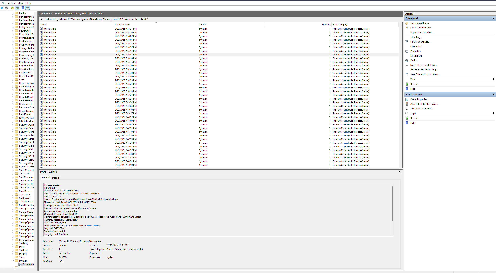

# Sysmon Detection Lab

## Lab Summary

In this lab, I deployed Sysmon to enhance Windows logging and monitor process creation events. I validated logging by executing PowerShell commands and analyzing Sysmon Event ID 1 entries in Event Viewer. This demonstrates hands on experience with endpoint monitoring, process visibility, and detection of potentially suspicious activity.

## Objective

Install Sysmon and verify that it logs process activity into Windows Event Viewer.

## Tools Used

- Windows 10
- Sysinternals Sysmon
- PowerShell
- Event Viewer

## Steps Performed

1. Downloaded Sysmon from Microsoft Sysinternals.
2. Installed Sysmon using:
   .\Sysmon64.exe -i sysmonconfig.xml
3. Verified Sysmon service and driver started successfully.
4. Opened Event Viewer and navigated to:
   Applications and Services Logs → Microsoft → Windows → Sysmon → Operational
5. Executed PowerShell command:
   powershell -Command "Get-Process"
6. Confirmed Event ID 1 (Process Create) captured the PowerShell execution.

## Proof of Logging

Event ID 1 recorded:

- Image: powershell.exe
- CommandLine: powershell -Command "Get-Process"
- Log Name: Microsoft-Windows-Sysmon/Operational

This confirms Sysmon successfully logged process creation activity and captured full command line arguments for analysis.

## Detection Use Case

### Scenario

An analyst investigates potential misuse of PowerShell on a Windows endpoint. PowerShell is commonly abused by attackers for execution, reconnaissance, and lateral movement.

### Detection Logic

Monitor Sysmon Event ID 1 (Process Creation) for:

- Execution of powershell.exe
- Suspicious or encoded command line arguments
- Execution from unusual parent processes

### Example from This Lab

In this lab, I executed:

powershell -Command "Get-Process"

Sysmon generated Event ID 1 with:

- Image: C:\Windows\System32\WindowsPowerShell\v1.0\powershell.exe
- CommandLine: powershell -Command "Get-Process"
- Log Name: Microsoft-Windows-Sysmon/Operational

This confirms that Sysmon captures detailed process execution data, allowing analysts to detect abnormal or malicious PowerShell activity.

## Key Findings

- Sysmon provides detailed process visibility beyond default Windows logs
- Command line arguments are fully captured
- Logs are stored in a dedicated Operational log
- Process activity can be monitored and analyzed for suspicious behavior

## Investigation Insight

This lab demonstrates how endpoint telemetry can support security investigations. By analyzing process creation events and command line arguments, analysts can identify suspicious execution patterns and detect potential attacker behavior.

## What I Learned

This lab showed how Sysmon enhances Windows logging by capturing detailed process creation data. Reviewing command line arguments in Event Viewer demonstrates how security teams track system activity and detect suspicious behavior. Sysmon provides deeper visibility than default logs and is a valuable tool for SOC analysts.

## Screenshots

### Sysmon Installation

### Sysmon Log Location

### Sysmon Operational Log

### PowerShell Process Logging

### Suspicious PowerShell Execution Test

Command executed:

powershell -ExecutionPolicy Bypass -NoProfile -Command "Write-Output test"

### Additional Command Activity

